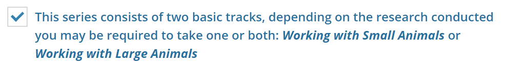
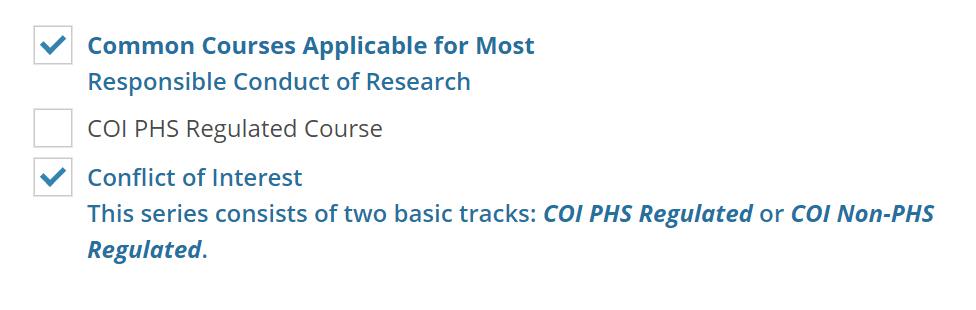
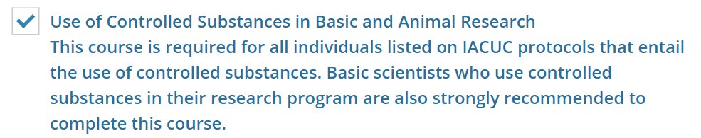

# Hello everyone!

# Lab-Instructions
## Required trainings
1. Citi trainings:
	* Go to [CITI website](https://www.citi.pitt.edu/) and login with PittID
	* Add "Working with small animals" (For how to find the course, please check [citi_training.pdf](https://www.iacuc.pitt.edu/sites/default/files/citi_training.pdf)
	  
	
	* Add "Working with Mice in Research Settings"
	
	  
	
	* Add "Responsible Conduct of Research" **and** "Conflict of Interest"
	
	  
	
	* Add “Use of Controlled Substances in Basic and Animal Research” 
	
	  

2. Other trainings (To be updated)

## Sign up GitHub

Click [here](./Signup-Github/Signup-GitHub.md)

